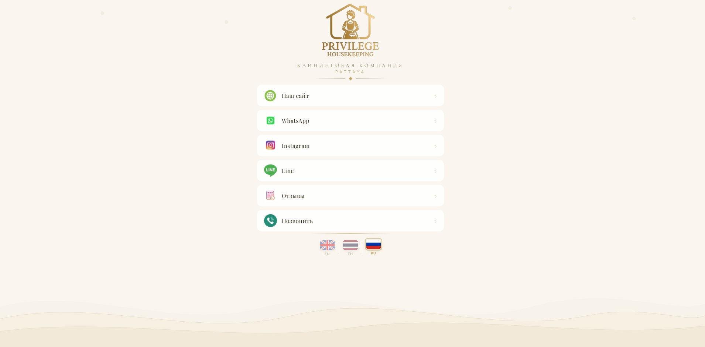

# Privilege Housekeeping - Link Page

> Мобильный лендинг-линкер для клининговой службы (Паттайя, Таиланд).  
> Открывается по QR-коду и объединяет все контакты компании в одну страницу.

---

## Демо

**[Открыть страницу](https://privilege-housekeeping-link.netlify.app/)**  

---

## Скриншот



---

## О проекте

Реальный коммерческий заказ. Клиент - клининговая компания в Таиланде. Задача: создать одну страницу, на которую ведёт QR-код с визиток и рекламных материалов. Посетитель видит все ссылки сразу - сайт, WhatsApp, Instagram, LINE, Google Reviews, телефон.

---

## Что реализовано

- 🌐 **Мультиязычность** (EN / TH / RU) - без фреймворков, чистый JS
- 💾 **Сохранение языка** через `localStorage` - при повторном открытии язык запоминается
- 📱 **Адаптивная вёрстка** - оптимизирована под мобильные устройства, всё видно без скроллинга
- 🎨 **Премиальный дизайн** - золотая палитра, шрифты Cormorant Garamond + Playfair Display
- ⚡ **Без зависимостей** - иконки и логотип встроены как base64, нет внешних JS-библиотек
- 🔗 **6 кнопок-ссылок**: сайт, WhatsApp, Instagram, LINE, Google Reviews, телефон

---

## Стек


- **HTML5** - семантическая разметка
- **CSS3** - Flexbox, кастомные анимации, backdrop-filter
- **JavaScript** - переключение языков, localStorage

---

## Структура файлов

```
|
└── index.html   # Всё в одном файле (стили, скрипт, base64-ресурсы)
```

---

## Запуск

Просто открой `index.html` в браузере - никаких зависимостей и сборщиков не нужно.

```bash
# Клонировать репозиторий
git clone https://github.com/твой-username/название-репо.git

# Открыть файл
open index.html
```

